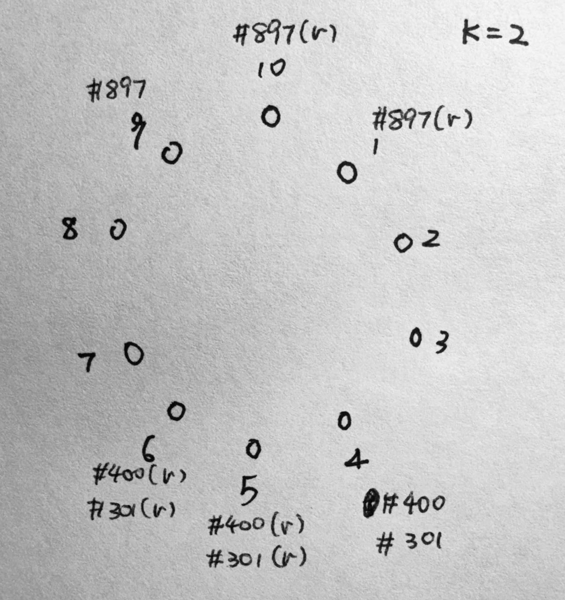
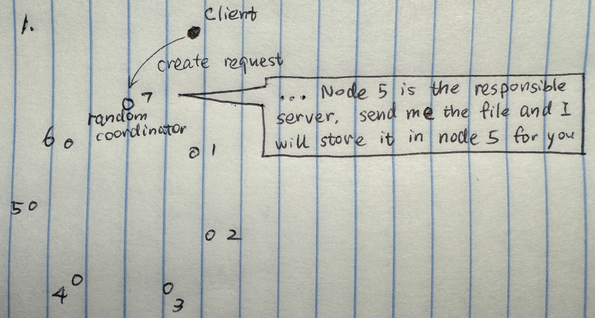
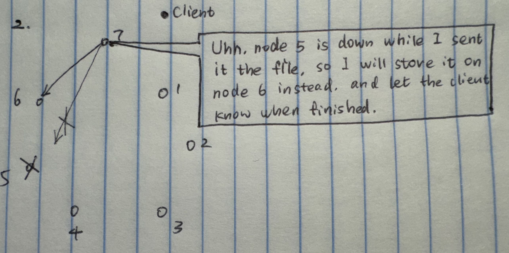
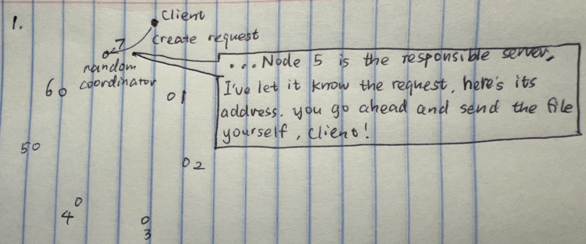
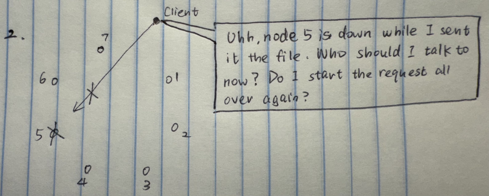
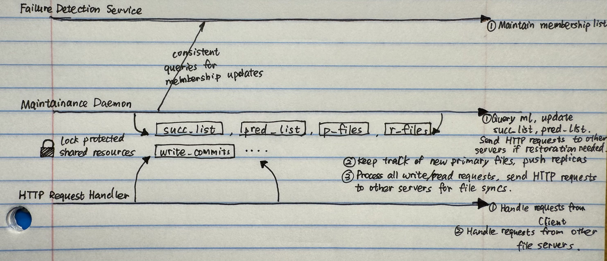

# HyDFS
Hybrid Distributed File System built for CS 425 MP3

## Run
Go to ```src``` folder

    go run . {n}

where n is the machine id from 1 to 10.

## Design
1. The total number of servers is expected to be not larger than 10.
2. All servers use a pre-determined consistent hashing to map servers and files to points on a ring.
3. A file is replicated on the first *n* successor servers in the ring.
4. Each server maintains a full membership list (based on failure detection). Given a filename, a server can route the request to one of the replicas in *O(1)* time.
5. Supported file size should be at least 100s of MBs.
6. Client-side caching. Cache the **file reads** only.

## Tolerance
1. Data stored in HyDFS is tolerant of up to two *simultaneous* machine failures. 
2. A pull-based re-replication is applied (each node periodically checks if its n predecessors has changed).

## Consistency
1. Appends are eventually applied in the same order across the replicas of a file (eventual consistency).
2. Two appends from the same client should be applied in order.
3. ```get``` operation should return the latest appends that the same client performed (not necessarily reflecting others').

## Allowed File Operations
1. ```create localfilename HyDFSfilename``` to create a file on HyDFS being a copy of the local file. Only the first time creation should be accepted.
2. ```get HyDFSfilename localfilename``` to fetch file from HyDFS to local.
3. ```append localfilename HyDFSfilename``` appends the content to HyDFS file, it requires the destination file to be already exist.
4. ```merge HyDFSfilename``` once merge completes, all replicas of a file are identical (**assume that no concurrent updates/failures happen during merge**). An immediate call of merge after a previous merge should return immediately.
5. Testing purpose: ```ls HyDFSfilename``` lists all machine (VM in the test case) addresses and IDs on the ring where this file is currently being stored.
6. On server, testing purpose: ```store``` lists all files together with their IDs on the ring currently stored at this machine. Also, print the machine's ID on the ring.
7. Testing purpose: ```getfromreplica VMaddress HyDFSfilename localfilename``` performs get but from the machine specified by the address.
8. On server, testing purpose: ```list_mem_ids``` lists the membership and the IDs on the ring corresponding to the nodes.

# Detailed Designs
## 1. Server Topology Structure
The servers are arranged in a ring structure, ordered by their server ids. In our case, we use 10 VMs as servers, hence the server ids are integers from 1 to 10. For any given file stored in the filesystem, the filename will be hashed as a string, the hash result will then mapped to an integer named as file number in between 1 - 1000. In our case, we assign file with file number ```n``` to its primary file server ```id``` such that ```(id * 100 + 1000 - n) mod 1000``` is the minimum. 

Each file will have ```k``` replications stored in ```k``` successors of its primary file server.

Below are three possible examples of the file system status in our setting of 10 VMs. ```k = 2```. Files stored are mapped to integers ```897, 301, 400```. A letter ```r``` is used in the graph to indicate replications. The leftmost one is the initial state with all 10 servers alive. The rest two graphs indicate two different possible failures that may occur from the initial state.

<div style="display: flex; justify-content: center; gap: 10px; margin: 0 auto;">
  
  
  
</div>

## 2. Server Failures
A failure detector is used to check the live status of all file servers. While the file server is running, it periodically calls a helper function of the failure detector, to get the list of all alive member ```id``` is the server.

The file system maintains a ```pred_list``` list of ```k``` predecessors according to the current membership list.

Examples:

    eg1. For server id = 3, k = 2
        Membership list = [1, 2, 3, 4, 5, 6, 7, 8, 9, 10]
        pred_list = [2, 1]
    
    eg2. For server id = 8, k = 2
        Membership list = [1, 2, 3, 4, 7, 8, 10]
        pred_list = [7, 4]

    eg3. For server id = 1, k = 3
        Membership list = [1, 2, 3, 4, 7, 8, 10]
        pred_list = [10, 8, 7]

Meanwhile, the filenames stored on each server are recorded in two separate lists. 
1. ```p_files``` stores the filenames that are assigned to this server according to ```(id * 100 + 1000 - n) mod 1000``` calculation.
2. ```r_files``` stores the filenames that are assigned to this server as replications of some other primary file server. 

In case of server failure, both replications and primary files need to be restored in other servers.

### 2.1 Failure Handling: Replication Restore
When server ```id = D``` is down, some of its **successors** need to restore the replication files originally replicated by ```D``` in its ```r_files```. 

To acheive this, each file server consistently monitor any changes happen in its k-predecessor list ```pred_list```. 

An example of such failure: 
<div style="display: flex; justify-content: center; gap: 10px; margin: 0 auto;">
  
  
</div>

    Consider server id = 7, k = 2
        cycle 1: 
            Membership list = [1, 2, 3, 4, 5, 6, 7, 8, 9, 10]
            pred_list = [6, 5]
            p_files = []
            r_files = []
        cycle 2:
            Membership list = [1, 2, 3, 4, 6, 7, 8, 9, 10]
            pred_list = [6, 4]
            p_files = []
            r_files = [#400, #301]
    
    Explanation: 
        The failure of server 5 is reflected in server 7's pred_list as 
        server 4 newly became one of server 7's predecessors. Server 7 doesn't 
        care WHO FAILED, it simply spots the NEW predecessor and ask for its 
        primary files.

At each cycle the membership list is queried by the file server, it checks if any new members show up in its ```pred_list``` compared to the last cycle. Use ```r_files``` to store replications from new predecessors' ```p_files```.

### 2.2 Failure Handling: Primary Restore
When server ```id = D``` is down, its **direct successor** need to restore the primary files originally stored by ```D``` in its ```p_files```. 

The complication here is that there might be consecutive server failures during the same cycle, hence some alive successor server may need to restore primary files of more than one server. 

An example of such failure:
<div style="display: flex; justify-content: center; gap: 10px; margin: 0 auto;">
  
  
</div>

    Consider server id = 5, k = 2
        cycle 1: 
            Membership list = [1, 2, 3, 4, 5, 6, 7, 8, 9, 10]
            pred_list = [4, 3]
            p_files = []
            r_files = [#400, #301]
        cycle 2:
            Membership list = [1, 2, 3, 5, 6, 7, 8, 9, 10]
            pred_list = [3, 2]
            p_files = [#400, #301]
            r_files = []
    
    Consider server id = 7, k = 2
        cycle 1: 
            Membership list = [1, 2, 3, 4, 5, 6, 7, 8, 9, 10]
            pred_list = [6, 5]
            p_files = []
            r_files = []
        cycle 2:
            Membership list = [1, 2, 3, 5, 6, 7, 8, 9, 10]
            pred_list = [6, 5]
            p_files = []
            r_files = [#400, #301] 

    Explanation: 
        Server 4 failed, server 5 restores server 4's primary files by moving 
        them from its own r_files to p_files. Meanwhile, server 5 push the replications 
        of these newly restored files to its k successors, including server 7.


To make things simpler, ```server 5``` **DOES NOT** intentionally monitor the live status of its direct predecessor ```server 4```. Instead, **whenever** there's an update in its ```pred_list```, ```server 5``` will iterate through all filenames in its own ```r_files```, and calculate ```(id * 100 + 1000 - n) mod 1000``` to check if ```id = 5``` is the minimum now, if YES, move that file from ```r_files``` to ```p_files```, **AND push the replications of this file** to ```server 5```'s ```k``` successors! (Pushing replications is necessary because from the perspective of ```server 7```, its ```pred_list``` doesn't change, so the replications of files ```#400``` and ```#301``` should be pushed by ```server 5``` rather than pulled by ```server 7```).

### 2.3 Rejoin
When a file server rejoins the network, its successors should iterate through the files in their ```p_files```, calculate ```(id * 100 + 1000 - n) mod 1000``` and find out those files that should below to others, send them to the corresponding servers and move them from its own ```p_files``` to ```r_files```.

The failure handling part helps the new comer to get its replicas. For some existing servers, some replicas are no longer needed after the join of new comer, so they will iterate through their own ```r_files``` and delete those files.
## 3. Request Handling
A general workflow of request handling in the HyDFS filesystem:

1. A ```client``` wants to make a request to the filesystem, it will first search for one alive file server as its ```coordinator```, and sends the request to it.
2. The ```coordinator``` should first check if the request is legal (reject the client if illegal), then act as a **man in the middle** to perform the request, meaning all dataflow for this request **involving the client** should run through the ```coordinator```.

The reason behind using such a **man in the middle** ```coordinator``` rather than the more efficient way of letting the client direct transfer files with the actual responsible file servers is that the ```coordinator``` always has the ability to handle potential failures during transactions, while the client may get lost if it got introduced to another file server which breaks down during the same cycle. 

An illustration of the **man in the middle** ```coordinator``` design.

<div style="display: flex; justify-content: center; gap: 10px; margin: 0 auto;">
  
  
</div>

An illustration of the potential issues in "introduction style".

<div style="display: flex; justify-content: center; gap: 10px; margin: 0 auto;">
  
  
</div>

### 3.1 Go Routines in HyDFS
Below is a draft of the Go Routines running on the file server.


### 3.2 Client Code
The logic of HyDFS client is straight-forward. Only a single process is needed for the client program to ask for commands from user input. Handle the command with a switch statement, make HTTP requests to the randomly selected ```coordinator``` server accordingly.

## Debug
Run

    go tool pprof http://localhost:6060/debug/pprof/profile
